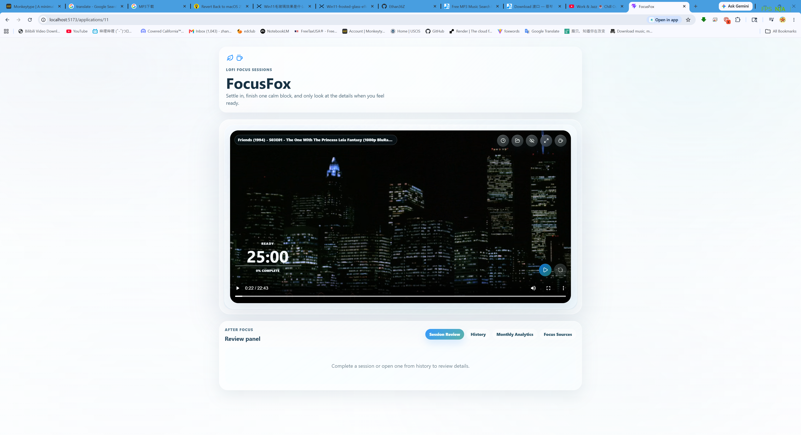
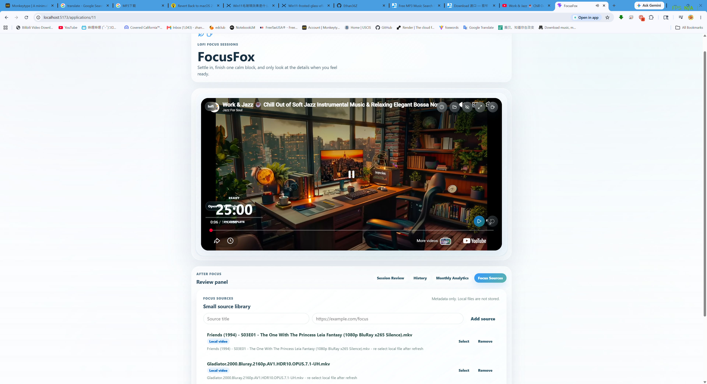
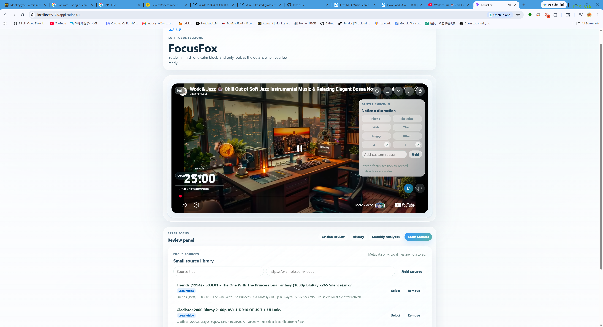
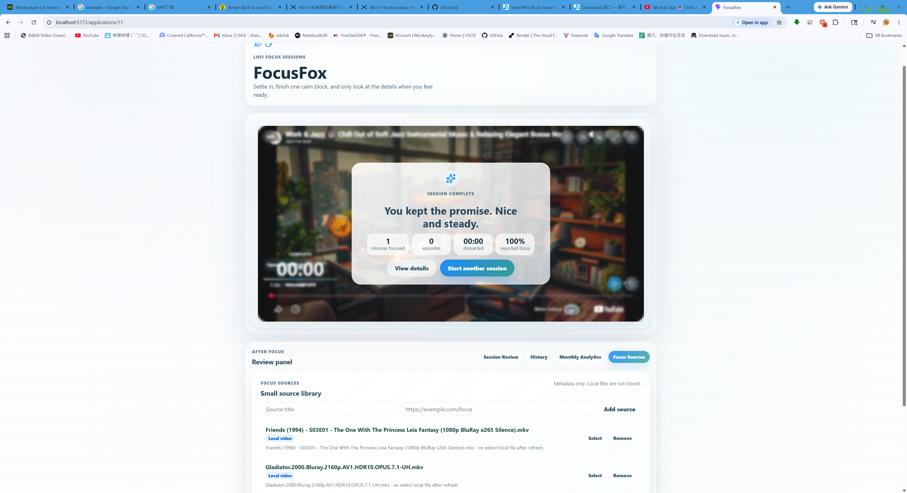
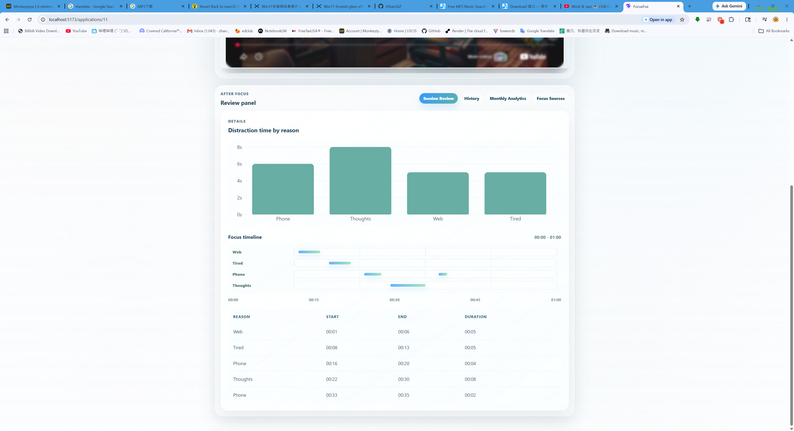
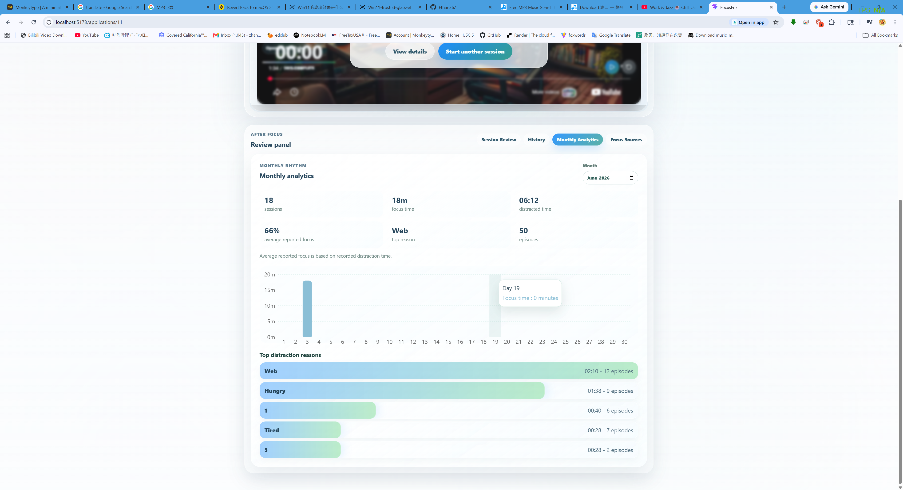
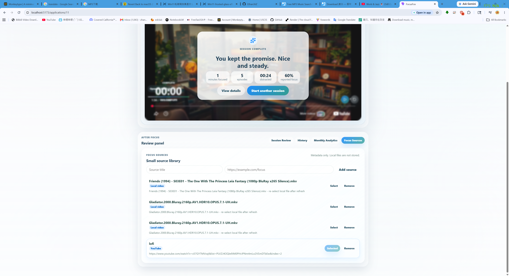
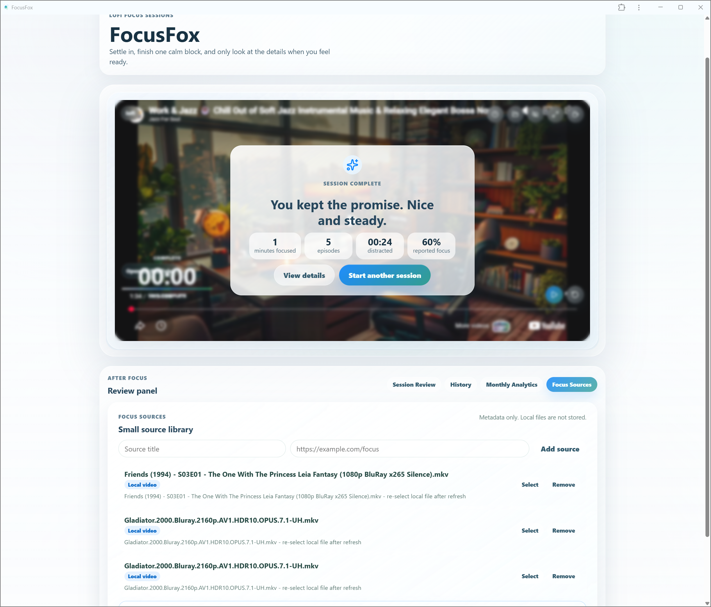

# FocusFox

A calm Pomodoro timer and distraction tracker for lofi focus sessions.

## Problem Statement

Many focus tools only measure time, but FocusFox helps users record what pulls
their attention away and review it after the session.

## Features

- Custom focus duration
- Start / pause / resume / reset
- Custom distraction reasons
- Timed distraction episodes
- Completion-first session summary
- Distraction duration chart
- Multi-lane focus timeline
- Details table
- Session history
- Reported focus percentage
- Monthly analytics dashboard
- Month selector
- Monthly totals for sessions, focus time, and distracted time
- Monthly average reported focus
- Top distraction reason
- Daily focus minutes chart
- Ranked distraction reason summary
- Local audio/video focus player
- Compact player chrome with timer HUD, duration menu, media picker, fullscreen,
  and timer visibility controls
- Active distraction overlay with a calm End action
- Tabbed review panel for session review, history, monthly analytics, and focus
  sources
- Small focus source library for saved source metadata
- YouTube official iframe embed for user-provided public links
- Bilibili official iframe embed for user-provided BV video links
- Basic PWA install support
- Local JSON export/import backup
- Local-first data storage with localStorage

## Tech Stack

- React
- TypeScript
- Vite
- Zustand
- Recharts
- localStorage
- CSS

## Local Setup

```bash
npm install
npm run dev
npm run build
```

## Deployment

FocusFox is a static Vite app and can be deployed to platforms such as Vercel
or Netlify.

- Build command: `npm run build`
- Output directory: `dist`
- Install command: `npm install`

For PWA install prompts, deploy to a real HTTPS URL. FocusFox does not use a
service worker yet, so install support is basic manifest-based PWA support; it
does not provide offline media playback.

## How to Use

1. Choose a focus duration.
2. Start a session.
3. Click a distraction reason when attention is pulled away.
4. Click the same reason again when returning to focus.
5. Review the completion summary, individual session timeline, chart, and
   history.
6. Use Monthly Analytics to review longer-term focus patterns by month.
7. Optionally choose a local media file or add a user-provided YouTube or
   Bilibili link as focus atmosphere.
8. Use Data Backup to export or import local FocusFox data as a JSON file.

## Product Design Notes

- Success-first completion: the app emphasizes finishing the focus session
  before inviting the user into details.
- Local-first privacy: completed sessions and custom reasons are stored in the
  browser with localStorage.
- Reported focus percentage is based only on user-recorded distraction time, so
  it should be read as a reflection aid rather than a perfect measurement.
- Monthly analytics helps users observe longer-term focus patterns without
  leaving the local app.
- YouTube support uses official iframe embeds for user-provided links. Some
  videos may not allow embedded playback.
- Bilibili support uses user-provided BV video links and official iframe embed
  behavior. Some videos may not allow embedded playback.
- FocusFox does not download, cache, rip, proxy, or redistribute third-party
  media.
- FocusFox is not a video browsing app: there is no search, recommendation
  feed, comments, playlist system, or entertainment browsing surface.
- Media is atmosphere. Focus is the product.

## PWA Install Support

FocusFox includes basic web app manifest support, so compatible browsers may
offer an install option. Focus/session data remains local-first in the browser.

This does not mean media works offline: local files must be re-selected after a
refresh, and YouTube/Bilibili embeds require their platforms to be available
online.

## Local Data Backup

FocusFox can export completed sessions, custom distraction reasons, and focus
source metadata to a JSON backup file. Import runs entirely in the browser and
asks before replacing local data.

Backups do not include local audio/video file contents. Local files remain
runtime-only and must be re-selected after refresh or restore. There is no cloud
sync.

## Product Docs

- [Product modes](docs/product-modes.md)
- [Design system](docs/design-system.md)

## Current Status

V2A is a local-first web app with a focus player prototype.

FocusFox is designed as a focus player, not a video browsing app. Media stays
in the background as atmosphere while the focus timer, distraction episodes,
review timeline, Monthly Analytics, Focus Source Library, local backup, and
basic PWA install support carry the product experience.

## Screenshots

















## Future Roadmap

- Yearly analytics
- Broader multi-source lofi player controls
- Optional Bilibili live support if safe
- Optional FreeTube/external player link support
- Browser overlay extension for video and livestream sites
- Optional theme/color controls
- Possible desktop/Tauri version
